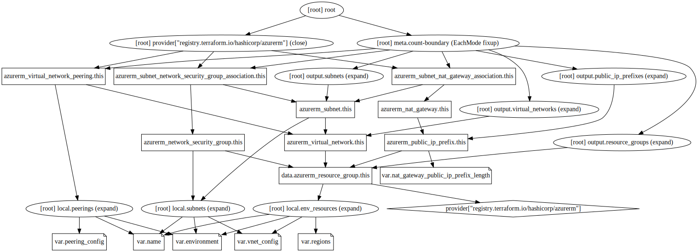

# Hub

This module is used to create a separate network in one of the subscriptions (usually PROD) and connect it to all the networks.

## Usage

Use together with the `core` module to create a peered network where SPOF (single point of failure) resources can be created, lik Azure Pipelines Agent Virtual Machine Scale Set (VMSS).

## Requirements

| Name | Version |
|------|---------|
| terraform | 0.13.5 |
| azurerm | 2.35.0 |

## Providers

| Name | Version |
|------|---------|
| azurerm | 2.35.0 |

## Inputs

| Name | Description | Type | Default | Required |
|------|-------------|------|---------|:--------:|
| environment | The environment (short name) to use for the deploy | `string` | n/a | yes |
| name | The name to use for the deploy | `string` | n/a | yes |
| nat\_gateway\_public\_ip\_prefix\_length | The Public IP Prefix length for NAT Gateway | `number` | `31` | no |
| peering\_config | Peering configuration | <pre>map(list(object({     name                         = string     remote_virtual_network_id    = string     allow_forwarded_traffic      = bool     use_remote_gateways          = bool     allow_virtual_network_access = bool   })))</pre> | `{}` | no |
| regions | The Azure Regions to configure | <pre>list(object({     location       = string     location_short = string   }))</pre> | n/a | yes |
| vnet\_config | Address spaces used by virtual network. | <pre>map(object({     address_space = list(string)     subnets = list(object({       name              = string       cidr              = string       service_endpoints = list(string)     }))   }))</pre> | n/a | yes |

## Outputs

| Name | Description |
|------|-------------|
| public\_ip\_prefixes | Public IP prefix information |
| resource\_groups | Resource group information |
| subnets | Subnet information |
| virtual\_networks | Virtual network information |

